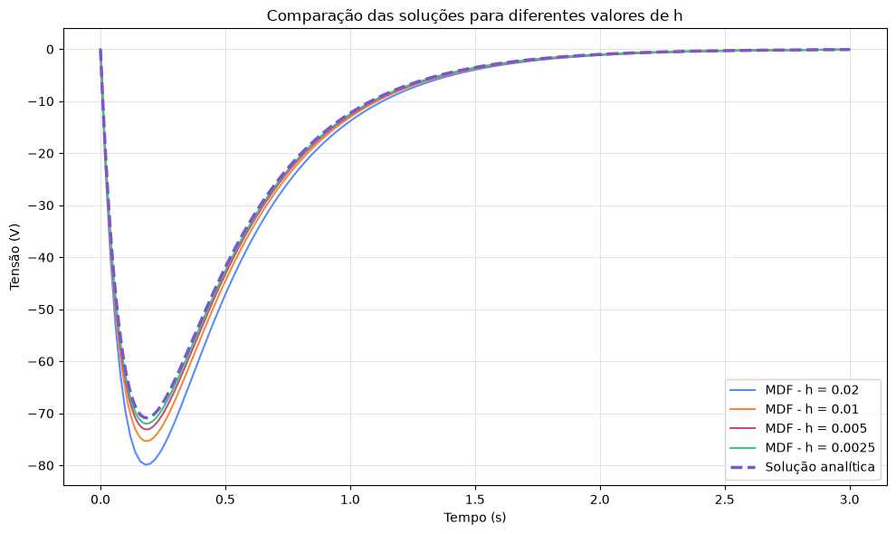
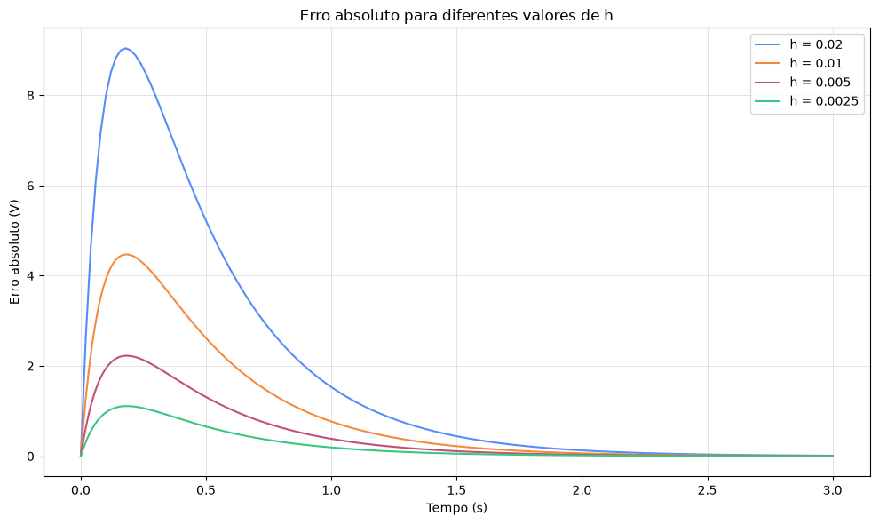

# Análise numérica de um circuito RLC em paralelo pelo Método das Diferenças Finitas

Este repositório contém a implementação computacional utilizada no estudo comparativo entre a **solução analítica** e a **solução numérica** de um circuito RLC em paralelo modelado por uma Equação Diferencial Ordinária (EDO) linear homogênea de segunda ordem.

A solução numérica é obtida pelo **Método das Diferenças Finitas (MDF)**. O estudo também avalia a influência do passo de discretização temporal `h` sobre o erro da aproximação numérica por meio do refinamento sucessivo da malha.

O repositório reúne o notebook, o código Python, os parâmetros utilizados, os resultados numéricos e os gráficos associados ao estudo.

---

## 1. Problema estudado

O circuito analisado é composto por resistor, indutor e capacitor conectados em paralelo.

### Parâmetros elétricos

| Parâmetro | Símbolo | Valor | Unidade |
| --- | --- | ---: | --- |
| Resistência | `R` | 20.0 | ohm |
| Indutância | `L` | 10.0 | H |
| Capacitância | `C` | 0.004 | F |

### Condições iniciais

| Grandeza | Valor | Unidade |
| --- | ---: | --- |
| `v(0)` | 0.0 | V |
| `v'(0)` | -1125.0 | V/s |

### Intervalo de simulação

```text
0 <= t <= 3 s
```

---

## 2. Modelo matemático

A aplicação da Lei de Kirchhoff das Correntes ao circuito RLC em paralelo conduz à seguinte EDO de segunda ordem:

```text
d²v(t)/dt² + (1/RC) dv(t)/dt + (1/LC) v(t) = 0
```

Para os parâmetros utilizados no estudo:

```text
R = 20 ohm
L = 10 H
C = 0.004 F
```

a equação assume a forma:

```text
d²v(t)/dt² + 12.5 dv(t)/dt + 25 v(t) = 0
```

A equação característica correspondente é:

```text
m² + 12.5m + 25 = 0
```

com raízes:

```text
m1 = -2.5
m2 = -10
```

Como as raízes são reais e distintas, a resposta do circuito analisado é classificada como **superamortecida**.

---

## 3. Solução analítica

Para as condições iniciais adotadas, a solução analítica utilizada como referência é:

```text
v(t) = 150 [e^(-10t) - e^(-2.5t)]
```

No código Python, a solução é implementada por:

```python
def solucao_analitica(t):
    return 150.0 * (np.exp(-10.0 * t) - np.exp(-2.5 * t))
```

A solução analítica é calculada nos mesmos instantes das malhas numéricas, permitindo a comparação ponto a ponto com a solução obtida pelo Método das Diferenças Finitas.

---

## 4. Método das Diferenças Finitas

Para a discretização da EDO, são utilizadas aproximações centrais para as derivadas de primeira e segunda ordem.

### Derivada de primeira ordem

```text
v'(ti) ≈ [v(i+1) - v(i-1)] / (2h)
```

### Derivada de segunda ordem

```text
v''(ti) ≈ [v(i+1) - 2v(i) + v(i-1)] / h²
```

Substituindo essas aproximações na EDO do circuito, obtém-se a relação de recorrência:

```text
v(i+1) = [(2 - 25h²)v(i) - (1 - 6.25h)v(i-1)] / (1 + 6.25h)
```

No código, os coeficientes são calculados por:

```python
A = 2.0 - (h**2) / (L * C)
B = 1.0 - h / (2.0 * R * C)
D = 1.0 + h / (2.0 * R * C)
```

e a recorrência é aplicada por:

```python
v[i + 1] = (A * v[i] - B * v[i - 1]) / D
```

---

## 5. Inicialização da solução numérica

A relação de recorrência necessita dos dois primeiros valores da malha.

O primeiro valor é determinado pela condição inicial:

```text
v0 = v(0) = 0
```

O segundo valor é obtido por uma aproximação progressiva aplicada à derivada inicial:

```text
v'(0) ≈ [v1 - v0] / h
```

Como:

```text
v'(0) = -1125 V/s
```

resulta:

```text
v1 = -1125h
```

No código:

```python
v[0] = v0
v[1] = v0 + h * vp0
```

---

## 6. Passos de discretização

Os passos temporais utilizados no estudo de refinamento são:

```python
h_values = [0.02, 0.01, 0.005, 0.0025]
```

O caso utilizado como referência é:

```python
h_ref = 0.01
```

Para realizar um novo estudo com outros valores de `h`, basta modificar a lista `h_values`.

Exemplo com cinco valores:

```python
h_values = [0.04, 0.02, 0.01, 0.005, 0.0025]
```

Para a análise das razões entre erros sucessivos, os valores devem ser organizados do maior para o menor.

---

## 7. Análise do erro

O erro absoluto em cada ponto da malha é calculado por:

```text
Ei = |vi - v(ti)|
```

em que:

- `vi` representa a solução numérica;
- `v(ti)` representa a solução analítica no mesmo instante;
- `Ei` representa o erro absoluto.

No código:

```python
erro = np.abs(v - v_exata)
```

### Erro máximo

```text
Emax = max(Ei)
```

Implementação:

```python
np.max(erro_h)
```

### Erro médio

```text
Emed = (1/N) * soma(Ei), para i = 0, ..., N-1
```

em que `N` representa o número de pontos da malha temporal.

Implementação:

```python
np.mean(erro_h)
```

---

## 8. Resultados do refinamento da malha

Os erros obtidos para os passos utilizados no estudo são apresentados a seguir.

| h (s) | Erro máximo (V) | Erro médio (V) |
| ---: | ---: | ---: |
| 0.0200 | 9.04481498 | 1.87361220 |
| 0.0100 | 4.47249024 | 0.93680988 |
| 0.0050 | 2.22506455 | 0.46840482 |
| 0.0025 | 1.10990249 | 0.23420230 |

Os valores mostram uma redução sistemática dos erros máximo e médio com a diminuição do passo de discretização.

### Razão entre erros máximos sucessivos

| Refinamento de h (s) | Razão entre erros máximos |
| --- | ---: |
| 0.0200 -> 0.0100 | 2.0223 |
| 0.0100 -> 0.0050 | 2.0100 |
| 0.0050 -> 0.0025 | 2.0047 |

As razões próximas de `2` são compatíveis com um comportamento aproximadamente de primeira ordem para a implementação adotada.

---

## 9. Gráficos

### Comparação entre as soluções

O gráfico abaixo apresenta a solução analítica e as soluções numéricas obtidas para os diferentes valores de `h`.



### Evolução do erro absoluto

O gráfico a seguir apresenta o erro absoluto ao longo do tempo para cada passo de discretização.



---

## 10. Estrutura do repositório

```text
circuito_rlc_mdf_publicacao/
|
|-- circuito_rlc_mdf.ipynb
|-- circuito_rlc_mdf.py
|-- README.md
|-- requirements.txt
|-- bibliotecas.txt
|
|-- input/
|   |-- parametros.txt
|   |-- parametros.csv
|   `-- h_values.csv
|
`-- output/
    |-- caso_referencia_h_0_01.csv
    |-- erros_refinamento.csv
    |-- razoes_erros_maximos.csv
    |-- resultados_notebook.txt
    |-- comparacao_solucoes_diferentes_h.png
    `-- erro_absoluto_diferentes_h.png
```

---

## 11. Arquivos principais

### `circuito_rlc_mdf.ipynb`

Notebook utilizado para desenvolvimento, execução e análise dos resultados.

O notebook contém:

- definição dos parâmetros;
- solução analítica;
- implementação do Método das Diferenças Finitas;
- caso de referência;
- estudo para diferentes valores de `h`;
- análise do erro;
- geração dos gráficos;
- cálculo das razões entre erros máximos sucessivos.

### `circuito_rlc_mdf.py`

Versão Python com as etapas computacionais utilizadas no notebook.

### `requirements.txt`

Contém as dependências necessárias para a execução do código.

### `bibliotecas.txt`

Registra as bibliotecas utilizadas diretamente na implementação.

---

## 12. Dados de entrada

A pasta `input/` registra os parâmetros utilizados no estudo.

```text
input/
|-- parametros.txt
|-- parametros.csv
`-- h_values.csv
```

### `parametros.txt`

Contém os parâmetros elétricos, condições iniciais, intervalo temporal e passos de discretização:

```text
R = 20.0 ohm
L = 10.0 H
C = 0.004 F

v0 = 0.0 V
vp0 = -1125.0 V/s

t0 = 0.0 s
tf = 3.0 s

h_ref = 0.01 s
h_values = [0.02, 0.01, 0.005, 0.0025] s
```

### `parametros.csv`

Apresenta os principais parâmetros em formato tabular.

### `h_values.csv`

Registra separadamente os passos temporais utilizados no estudo de refinamento.

> **Observação:** os arquivos da pasta `input/` documentam os dados utilizados. Na implementação atual, os parâmetros permanecem declarados diretamente no notebook e no arquivo Python.

---

## 13. Arquivos de saída

A pasta `output/` reúne os resultados associados à execução utilizada no estudo.

```text
output/
|-- caso_referencia_h_0_01.csv
|-- erros_refinamento.csv
|-- razoes_erros_maximos.csv
|-- resultados_notebook.txt
|-- comparacao_solucoes_diferentes_h.png
`-- erro_absoluto_diferentes_h.png
```

### `caso_referencia_h_0_01.csv`

Contém valores representativos de:

- tempo;
- solução numérica;
- solução analítica;
- erro absoluto;

para o caso de referência `h = 0.01 s`.

### `erros_refinamento.csv`

Contém os erros máximo e médio calculados para cada valor de `h`.

### `razoes_erros_maximos.csv`

Contém as razões entre os erros máximos obtidos para refinamentos consecutivos.

### `resultados_notebook.txt`

Contém as saídas textuais produzidas durante a execução do notebook.

### Arquivos de imagem

- `comparacao_solucoes_diferentes_h.png`: comparação entre solução analítica e soluções numéricas;
- `erro_absoluto_diferentes_h.png`: evolução temporal do erro absoluto.

---

## 14. Dependências

As dependências diretas da implementação são:

- NumPy;
- Matplotlib.

Instalação:

```bash
pip install -r requirements.txt
```

---

## 15. Execução

### Notebook

Abra o arquivo:

```text
circuito_rlc_mdf.ipynb
```

em um ambiente compatível, como:

- Jupyter Notebook;
- JupyterLab;
- PyCharm.

Execute as células na ordem apresentada.

### Arquivo Python

No terminal, dentro da pasta do projeto:

```bash
python circuito_rlc_mdf.py
```

A execução realiza:

1. definição dos parâmetros do circuito;
2. cálculo da solução analítica;
3. cálculo da solução numérica pelo MDF;
4. execução do caso de referência;
5. refinamento da malha para diferentes valores de `h`;
6. cálculo dos erros;
7. geração dos gráficos;
8. cálculo das razões entre erros máximos sucessivos.

---

## 16. Reprodutibilidade

O repositório disponibiliza conjuntamente:

- código-fonte;
- notebook;
- parâmetros utilizados;
- passos de discretização;
- resultados numéricos;
- indicadores de erro;
- gráficos gerados.

Essa organização permite reproduzir a análise computacional apresentada no estudo e realizar novos testes com outros valores de `h`, mantendo a mesma formulação numérica.
